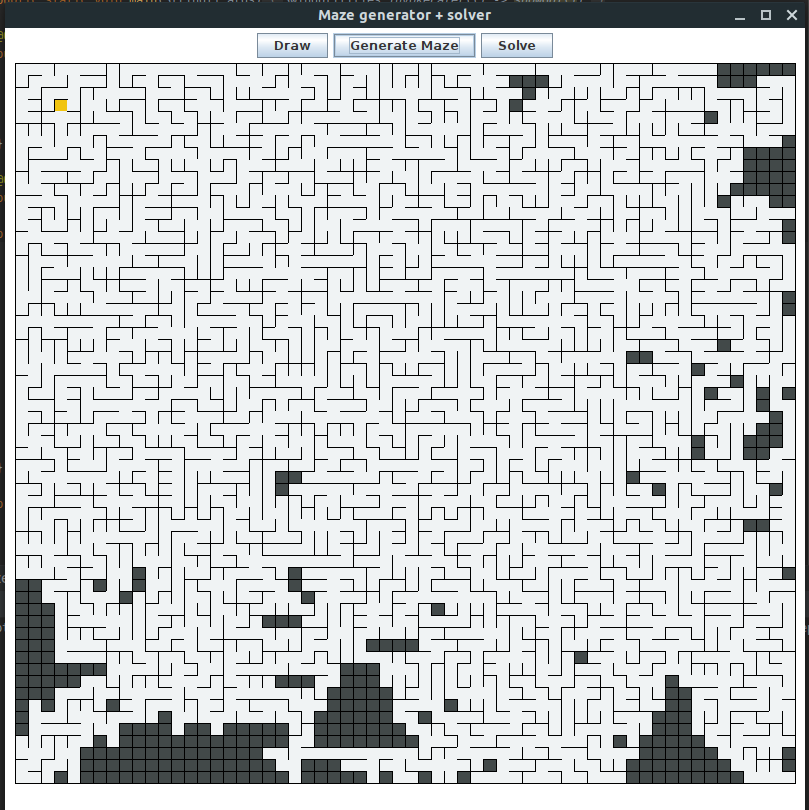

# Maze Generator coupled with A* path finding
## Intro
This program has been written in java using JFrame for my own experimental purpose. I need to figure out how path finding algorithm works so i decided to implement one. So basically, this is my first attempt. Implementing an algorithm and printing the output on console is great but seeing the output directly on a UI is far better and more challenging - Hence the use of JFrame.  

I needed to make it, to build it, to do it by myself so I just started and seeing the result give me an enormous feeling of satisfaction.  

## Getting started
Clone the project.  
Run Maze.java under **org.mahefa.matrix.maze.controller**.

## Build your own
Generate a matrix of size n x m.  
Apply [*Aldous-Border*'s algorithm](https://en.wikipedia.org/wiki/Maze_generation_algorithm) to generate a maze.  
Use [A* algorithm](https://en.wikipedia.org/wiki/A*_search_algorithm) or another path finding.  
For A*, we can optimized it by implementing min-heap or priority queue to store visited neighbors. The *heapify* method should be based on the f score value. So, in our case, since we are using a min-heap, we put the node with the lower f score value on top of the queue. The lattest guaranteed us to retreive the node with the lowest f score value in a complexity of O(1).  
For more details about min-heap and priority queue [click here](https://www.programiz.com/dsa/heap-data-structure) and [here](https://www.programiz.com/dsa/priority-queue).  
In my case, I've implemented min-heap using an array (Dynamic array) instead of list. So, if you wanna do the same refer [here](https://www.javatpoint.com/dynamic-array-in-java)

## Screenshots
### Create matrix

  
  

### Generate maze

  
  

### Solve

  
  

## Go further
Implementing different path finding algorithm such as BFS, DFS, et cetera  
Implementing different maze generator algorithm
