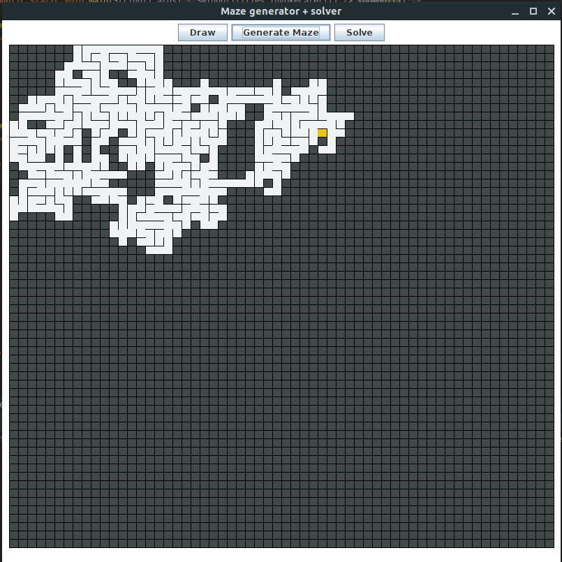

# Run
Clone the project.&nbsp;
Run Maze.java under **org.mahefa.matrix.maze.controller**.

# Build your own
Generate a matrix of size n x m.&nbsp;
Apply *Aldous-Border*'s algorithm to generate a maze.&nbsp;
use A* algorithm or another path finding.&nbsp;
For A*, we can optimized it by implementing min-heap or priority queue to store visited neighbors and by the way, get a time 
complexity of *O(1)* while retrieving the lowest f score value.&nbsp;

## Create matrix

## Generate maze

## Solve

